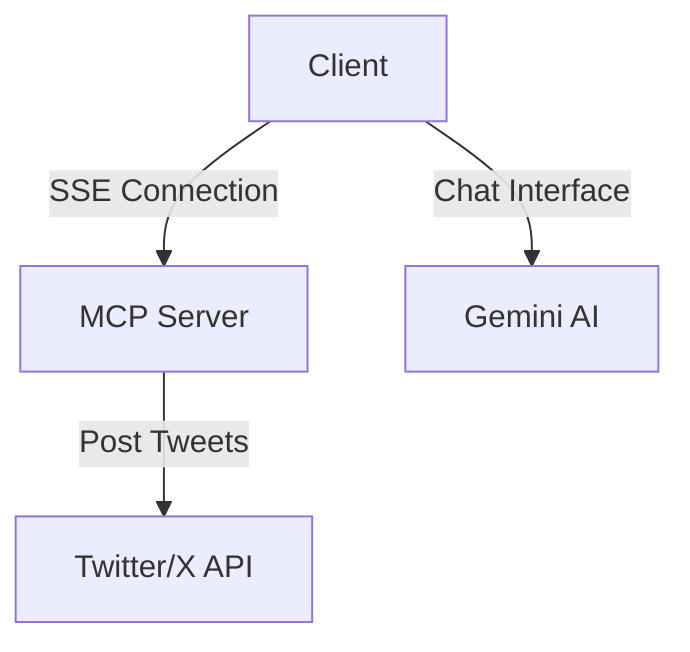

# X-Atomation 🤖

A powerful automation system that combines Google's Gemini AI with Twitter/X integration through a Model Context Protocol (MCP) architecture.

## 🏗 Project Architecture



### Components Flow:
1. **Client** (`/client`):
   - Handles user interaction through a CLI
   - Connects to Gemini AI for processing commands
   - Communicates with the MCP server via SSE

2. **Server** (`/server`):
   - Implements MCP protocol
   - Provides tools for Twitter/X integration
   - Handles API communication with Twitter

## 🚀 Getting Started

### Prerequisites

- Node.js (v16 or higher)
- npm/yarn
- Google Gemini API key
- Twitter Developer Account with API credentials

### Installation Steps

1. **Clone the repository**
   ```bash
   git clone https://github.com/yourusername/x-atomation.git
   cd x-atomation
   ```

2. **Install dependencies**
   ```bash
   # Install client dependencies
   cd client
   npm install

   # Install server dependencies
   cd ../server
   npm install
   ```

3. **Set up environment variables**

   Create `.env` files in both client and server directories:

   **Client** (`/client/.env`):
   ```env
   GEMINI_API_KEY=your-gemini-api-key-here
   ```

   **Server** (`/server/.env`):
   ```env
   TWITTER_API_KEY=your-twitter-api-key
   TWITTER_API_SECRET=your-twitter-api-secret
   TWITTER_ACCESS_TOKEN=your-twitter-access-token
   TWITTER_ACCESS_TOKEN_SECRET=your-twitter-access-token-secret
   ```

4. **Start the server**
   ```bash
   cd server
   node index.js
   ```
   The server will start on http://localhost:3001

5. **Start the client**
   ```bash
   cd client
   node index.js
   ```

## 🔑 API Keys Setup

### Google Gemini API
1. Visit [Google AI Studio](https://makersuite.google.com/app/apikey)
2. Create or sign in to your Google account
3. Generate an API key
4. Add it to the client's `.env` file

### Twitter/X API
1. Visit [Twitter Developer Portal](https://developer.twitter.com/en/portal/dashboard)
2. Create a new app or use an existing one
3. Generate the required credentials:
   - API Key
   - API Secret
   - Access Token
   - Access Token Secret
4. Add them to the server's `.env` file

## 💡 Features

- 🤖 AI-powered chat interface
- 🐦 Twitter/X post automation
- 🔄 Real-time communication via SSE
- 🛠 Extensible tool system

## 🛠 Available Tools

1. **addTwoNumbers**
   - Adds two numbers together
   - Parameters: `a` (number), `b` (number)

2. **createPost**
   - Creates a post on Twitter/X
   - Parameters: `status` (string)

## 📝 Usage Example

Once both client and server are running:

1. The client will present you with a chat interface
2. Type your commands naturally
3. The AI will understand and execute the appropriate tool

Example commands:
```
You: Add the numbers 5 and 3
AI: Let me help you with that calculation
[Tool Result: The sum of 5 and 3 is 8]

You: Post a tweet saying "Hello from X-Atomation!"
AI: I'll help you post that tweet
[Tool Result: Tweeted: Hello from X-Atomation!]
```

## 🤝 Contributing

Feel free to contribute to this project by:
1. Forking the repository
2. Creating a new branch
3. Making your changes
4. Submitting a pull request

## 📄 License

This project is licensed under the MIT License - see the LICENSE file for details.

## ⚠️ Important Notes

- Never commit your `.env` files
- Keep your API keys secure
- The server must be running before starting the client
- Make sure you have appropriate Twitter/X API access levels for posting
